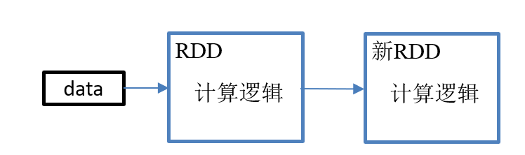
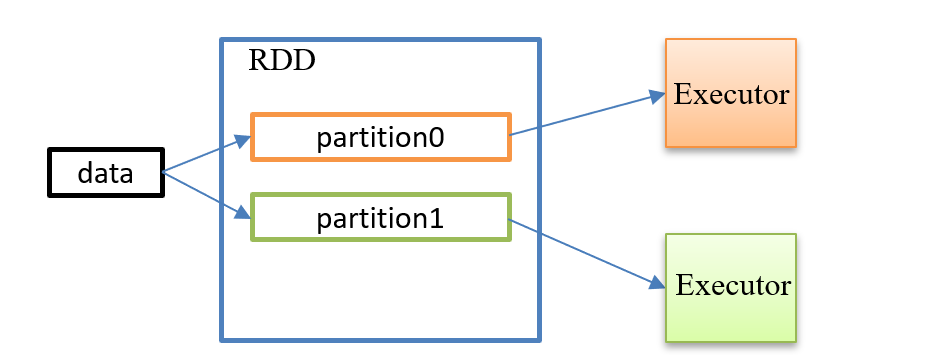

### Spark核心编程（一）

#### 什么是RDD？

RDD (Rssilient Distributed Dataset ) 弹性分布式数据集，是Spark中最基本的数据抽象，在代码中是一个抽象类，它代表一个弹性的、不可变的、可分区、里面的元素可以进行并行计算的集合。

解释：

弹性：

存储弹性：内存与磁盘自动切换

容错弹性：数据丢失可以自动恢复

计算弹性：计算出错重试

分片弹性：可根据需要进行重新分片

分布式：

数据存储在大数据集群不同的节点上

数据集：

RDD封装了计算逻辑，并不保存数据。

数据抽象

RDD是一个抽象类，需要子类具体实现

不可变：

RDD封装的计算逻辑是不可以进行改变的，想要改变只能重新生成新的RDD，在新的RDD中进行封装计算逻辑。

可分区、并行计算

Ø  A list of partitions

多个分区，分区可以看成是数据集的基本组成单位

对于 RDD 来说， 每个分区都会被一个计算任务处理， 并决定了并行计算的粒度。

用户可以在创建 RDD 时指定 RDD 的分区数， 如果没有指定， 那么就会采用默认值。 默认值就是程序所分配到的 CPU Core 的数目.

每个分配的存储是由BlockManager 实现的， 每个分区都会被逻辑映射成 BlockManager 的一个 Block,，而这个 Block 会被一个 Task 负责计算

Ø  A function for computing each split

​      计算每个切片(分区)的函数.

​      Spark 中 RDD 的计算是以分片为单位的，每个 RDD 都会实现compute函数以达到这个目的。

Ø  A list of dependencies on other RDDs

​      与其他 RDD 之间的依赖关系

​      RDD 的每次转换都会生成一个新的 RDD， 所以 RDD 之间会形成类似于流水线一样的前后依赖关系。 在部分分区数据丢失时，Spark 可以通过这个依赖关系重新计算丢失的分区数据， 而不是对 RDD 的所有分区进行重新计算

Ø  Optionally, a Partitioner for key-value RDDs (e.g. to say that the RDD is hash-partitioned)

​      对存储键值对的 RDD，还有一个可选的分区器

​      只有对于 key-value的 RDD，才会有 Partitioner, 非key-value的 RDD 的 Partitioner 的值是 None;Partitiner 不但决定了 RDD 的本区数量, 也决定了 parent RDD Shuffle 输出时的分区数量。

Ø  Optionally, a list of preferred locations to compute each split on (e.g. block locations for an HDFS file)

​      存储每个切片优先(preferred location)位置的列表

​      比如对于一个 HDFS 文件来说, 这个列表保存的就是每个 Partition 所在文件块的位置. 按照“移动数据不如移动计算”的理念, Spark 在进行任务调度的时候, 会尽可能地将计算任务分配到其所要处理数据块的存储位置.